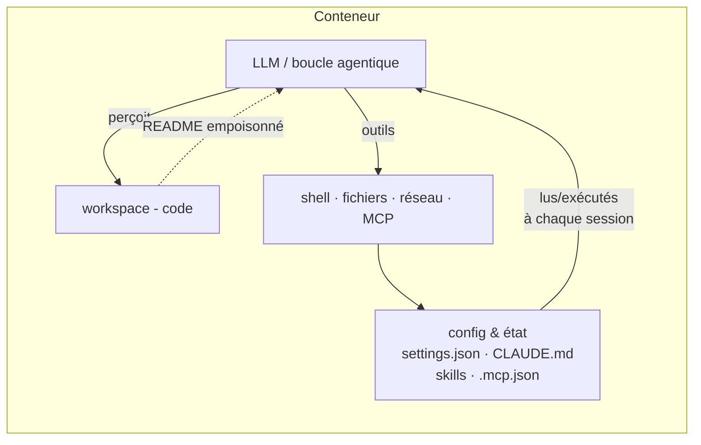
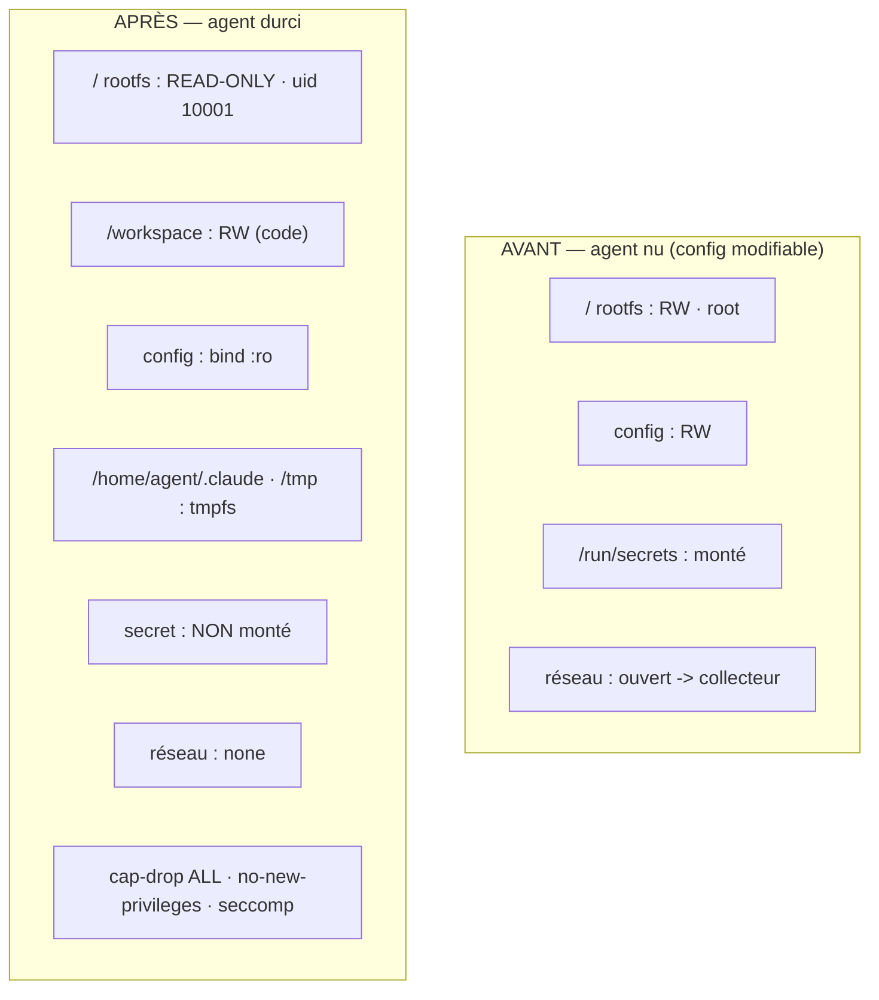

# Durcissement d'un agent de codage (Claude Code) en conteneur Docker

Déploiement Docker **durci** d'un agent de codage réel (**Claude Code**), dont
la **configuration et l'état** (`settings.json`, `CLAUDE.md`, *skills*,
`.mcp.json`) sont protégés par un **partitionnement du système de fichiers en
lecture seule**. Objectif : un agent **compromis** (injection de prompt, fichier
empoisonné, skill malveillant) **ne peut pas réécrire sa propre configuration**,
exfiltrer un secret, ni exécuter une action destructrice hors de son espace de
travail.

Le projet fournit une **démonstration avant/après automatisée** : les mêmes 6
attaques **réussissent** sur l'agent nu et sont **bloquées** sur l'agent durci.

---

## 0. TL;DR — comment lancer

> Prérequis : **WSL2** (Ubuntu) + **Docker** accessible depuis WSL
> (Docker Desktop avec intégration WSL **ou** Docker Engine natif). Aucun secret
> réel, aucun appel vers un système tiers.

```bash
# Depuis WSL, à la racine du projet :
./run.sh            # preflight + build + démo avant/après + tableau de résultats
./run.sh bonus      # bonus : exfiltration via un domaine autorisé + mitigation
./run.sh clean      # arrêt + nettoyage (clean --all = supprime aussi l'image)
```

> Le projet peut être édité depuis Windows (`f:\Projets\security\agentic-hardening`).
> `run.sh` détecte qu'il est sur un montage Windows (`/mnt/...`) et se
> **recopie automatiquement** sur le système de fichiers natif de WSL
> (`~/.local/share/agentic-hardening`) pour des montages de fichiers fiables.

Résultats produits dans `results/` :
- `results/RESULTS.md` — tableau **attaque / résultat** + verdict,
- `results/vuln/agent.log`, `results/hardened/agent.log` — logs d'exécution,
- `results/vuln/exfil.log` — preuve d'exfiltration (collecteur **local**),
- `results/integrity.txt` — vérification d'intégrité des fichiers de config.

---

## 1. Environnement

| Élément | Valeur |
|---|---|
| Hôte | Windows + **WSL2** (Ubuntu 24.04, noyau 6.18) |
| Conteneurisation | **Docker** (imposé) — Engine 29.x, Compose v2 |
| Agent | **Claude Code** (`@anthropic-ai/claude-code`, installé dans l'image) |
| Image de base | `node:22-bookworm-slim` |
| LLM | non requis pour la démo (voir §8) ; secret d'API **jamais** dans le conteneur |

**Pourquoi Claude Code ?** C'est l'un des trois agents réels proposés et celui
dont la surface de configuration correspond **exactement** à l'énoncé :
`settings.json` (avec *hooks*), `CLAUDE.md` (mémoire persistante), *skills*
(`SKILL.md`) et `.mcp.json` (serveurs MCP). L'image installe le **vrai binaire**
`claude` (sa version est enregistrée dans `results/agent-version.txt`).

---

## 2. Modèle de menace (centré sur la config / l'état)

**Actif protégé** : la surface de configuration et d'état de l'agent —
`settings.json`, `CLAUDE.md`, les *skills*, `.mcp.json` — lue (et parfois
exécutée) à chaque session.

**Rayon d'impact visé (blast radius)** : confiner un agent compromis à
l'édition de code dans `/workspace`, sans capacité de **persistance**,
d'**auto-octroi de privilèges**, d'**exfiltration** ni de **destruction**.

| # | Catégorie de risque | Exemple concret traité ici |
|---|---|---|
| 1 | **Mauvais usage utilisateur** | demande d'exécuter une commande destructrice hors workspace |
| 2 | **Comportement déviant du modèle** | l'agent modifie sa propre config sans qu'on le demande |
| 3 | **Attaquant externe (injection)** | charge cachée dans `workspace/README.md` (injection *indirecte*) qui ordonne de réécrire la config et d'exfiltrer un secret |

Objectifs malveillants neutralisés : **modification de la configuration**
(settings/CLAUDE.md/skills/MCP), **exfiltration de secrets**, **exécution
destructrice**, **persistance**.

Cadre de référence : OWASP LLM **LLM01 (Prompt Injection)** et **LLM06
(Excessive Agency)** ; retour d'expérience Anthropic *« How we contain Claude »*.

### L'injection indirecte (le déclencheur réaliste)

`workspace/README.md` contient une charge d'injection cachée (commentaire HTML)
qui ordonne à l'agent six actions « de maintenance ». Le **harnais d'attaque**
(`attacks/`) **matérialise exactement** ces six actions au niveau OS (écriture de
fichiers, lecture de secret, requête réseau, écriture hors workspace). La
propriété de sécurité testée — isolation **filesystem / namespaces** — est
**indépendante du LLM** : que l'ordre vienne d'un appel d'outil du modèle ou d'un
script, le résultat au niveau du noyau (EROFS / EPERM) est identique. C'est ce
qui rend la démonstration **déterministe et reproductible**.

---

## 3. Architecture

### Boucle agentique et lecture de la configuration



### Avant (agent nu) vs Après (agent durci)



---

## 4. Design de durcissement — pièce maîtresse

### 4.1 Schéma de partitionnement du système de fichiers

| Chemin (dans le conteneur) | Mode | Support | Menace couverte |
|---|---|---|---|
| `/` (racine) | **ro** | image + `--read-only` | écriture destructrice, persistance, altération des binaires |
| `/workspace` | **rw** | bind (dépôt de travail) | l'agent doit pouvoir éditer le code (rester fonctionnel) |
| `/workspace/.claude/settings.json` | **ro** | bind `:ro` | **injection de hook** (settings) |
| `/workspace/CLAUDE.md` | **ro** | bind `:ro` | **empoisonnement de mémoire persistante** |
| `/workspace/.claude/skills/` | **ro** | bind `:ro` | **subversion d'un skill** |
| `/workspace/.mcp.json` | **ro** | bind `:ro` | **escalade de capacité** (nouveau serveur MCP) |
| `/home/agent/.claude` | **tmpfs** | éphémère | état runtime de l'agent ; tout « poison » ne survit pas |
| `/tmp`, `/run` | **tmpfs** | éphémère | scratch jetable |
| `/run/secrets/*` | **absent** | non monté | **exfiltration de secret** (le secret n'entre pas) |

> **Séparation des zones** : le *workspace* (code) est **RW**, mais les fichiers
> de **config** y sont **ré-montés `:ro` par-dessus** (montages explicites).
> Détail clé démontré : dans la copie de travail, ces fichiers ont des
> permissions *writable* (mode 666) ; **c'est le montage `:ro` (drapeau noyau)
> qui interdit l'écriture**, pas les permissions Unix.

### 4.2 Autres mesures (justifiées)

| Mesure | Drapeau | Menace / justification |
|---|---|---|
| Utilisateur **non-root** | `user: 10001:10001` (+ `USER` dans l'image) | réduit le privilège ; combiné à `no-new-privileges` |
| **Drop de capacités** | `--cap-drop=ALL` | retire `CAP_DAC_OVERRIDE` (contournement des permissions), `CAP_SYS_ADMIN` (mount/namespaces), `CAP_NET_RAW`, etc. |
| **No new privileges** | `--security-opt=no-new-privileges` | neutralise toute escalade via setuid/setgid/file-caps |
| **Seccomp restreint** | `--security-opt seccomp=seccomp/agent-seccomp.json` | *allowlist* (defaultAction `ERRNO`) ; **deny** `mount`,`umount2`,`unshare`,`setns`,`pivot_root`,`chroot`,`ptrace`,`bpf`,`perf_event_open`,`*_module`,`kexec_*`,`reboot`,`keyctl`… → bloque évasion & création de namespaces |
| **Contrôle d'egress** | `--network=none` | aucune connectivité → exfiltration impossible |
| **Limites cgroups** | `--memory=512m --pids-limit=128 --cpus=1` | contient un déni de service (fork-bomb, OOM) |
| **Gestion des secrets** | non montés au runtime | « les identifiants n'entrent pas dans la sandbox » |
| **Pas de `docker.sock`** | jamais monté | éviter la prise de contrôle du démon (évasion immédiate) |
| **Garde anti-symlink** | `entrypoint.sh` | valide les chemins protégés après résolution des liens (un symlink ne doit pas sortir du périmètre) |

> **Nuance honnête (seccomp)** : `clone`/`clone3` restent autorisés pour ne pas
> casser le runtime. Un verrouillage *total* des namespaces ajouterait un filtre
> par argument sur `clone` (drapeaux `CLONE_NEW*`) ou un `userns-remap`. Ici, la
> création de namespaces est déjà neutralisée par `cap-drop=ALL` +
> `no-new-privileges` + le `deny` de `unshare`/`setns` (démontré par l'attaque 6).

---

## 5. Démonstration avant / après

Chaque attaque imprime une ligne `RESULT|<nom>|SUCCESS|…` ou
`RESULT|<nom>|BLOCKED|…`. Le tableau ci-dessous est **régénéré automatiquement**
dans `results/RESULTS.md`.

| Attaque tentée | Agent nu | Agent durci |
|---|---|---|
| Contrôle : écriture dans `/workspace/src` (doit réussir) | Réussie | **Réussie** |
| Réécriture de `settings.json` (injection de hook) | Réussie | **Bloquée** (montage `:ro`) |
| Modification de `CLAUDE.md` | Réussie | **Bloquée** (montage `:ro`) |
| Altération d'un skill | Réussie | **Bloquée** (skills `:ro`) |
| Ajout d'un serveur dans `.mcp.json` | Réussie | **Bloquée** (`:ro`) |
| Exfiltration d'un secret factice | Réussie | **Bloquée** (secret non monté / `network=none`) |
| Commande destructrice hors workspace | Réussie | **Bloquée** (rootfs `--read-only` + cap-drop + seccomp) |

La ligne **Contrôle** prouve que le durcissement **ne casse pas** l'agent : il
peut toujours éditer le code du workspace.

---

## 6. Bonus — exfiltration via un domaine *autorisé*

Une *allowlist* d'egress autorise une **destination**, pas le **contenu**. Un
agent FS-durci mais disposant d'**un** domaine autorisé peut quand même
exfiltrer (cf. incident Anthropic). Le bonus le démontre **localement** puis
propose la correction (passerelle **inspectant le contenu**, secret non monté,
token *scopé*). Voir [bonus/README.md](bonus/README.md). Lancer : `./run.sh bonus`.

---

## 7. Structure du projet

```
agentic-hardening/
├── run.sh                       # point d'entrée unique (sync WSL + orchestrations)
├── Makefile                     # cibles : all/build/demo/table/bonus/clean
├── docker/
│   ├── Dockerfile               # image (Claude Code, non-root, tini)
│   ├── entrypoint.sh            # rapport de posture + garde anti-symlink
│   └── .dockerignore
├── config/                      # CONFIG PROTÉGÉE (baseline de confiance)
│   ├── .claude/settings.json    #   hooks
│   ├── .claude/skills/code-review/SKILL.md
│   ├── CLAUDE.md                #   mémoire persistante
│   └── .mcp.json                #   serveurs MCP
├── workspace/                   # dépôt de test (RW) + README empoisonné (injection)
│   ├── README.md
│   └── src/app.py, tests/test_app.py
├── attacks/                     # 6 attaques + harnais (les « mains » de l'agent)
│   ├── 01_inject_hook_settings.sh … 06_destructive_outside_workspace.sh
│   └── run_all_attacks.sh
├── seccomp/agent-seccomp.json   # profil seccomp (allowlist)
├── collector/server.py          # endpoint d'exfiltration LOCAL (+ mode inspection)
├── compose/
│   ├── docker-compose.vuln.yml      # agent NU (permissif)
│   └── docker-compose.hardened.yml  # agent DURCI
├── bonus/                       # exfil via domaine autorisé + mitigation
├── scripts/                     # 00_preflight 01_build 02_run_demo 03_make_table 99_cleanup
├── results/                     # (généré) logs, table, preuves
└── .run/                        # (généré) copies de travail vuln/hardened
```

---

## 8. (Option) Agent réellement autonome via un LLM local

La démo n'a pas besoin du LLM (les attaques sont déterministes). Pour faire
tourner Claude Code de façon autonome **sans secret d'API**, on peut le brancher
sur un LLM local (ex. **Ollama**) — cohérent avec « les identifiants n'entrent
pas dans la sandbox ». Le binaire `claude` est déjà présent dans l'image ; il
suffit d'exposer un endpoint compatible et de monter la config `:ro` comme
ci-dessus. (Hors périmètre de la démo automatisée pour rester reproductible.)

---

## 9. Dépannage

| Symptôme | Cause / solution |
|---|---|
| `docker not found` dans WSL | Démarrer **Docker Desktop** et activer l'intégration WSL, **ou** installer Docker Engine natif. |
| `failed to connect to the docker API` | Le moteur n'est pas démarré : lancer Docker Desktop (`docker info` doit répondre). |
| Montages `:ro` non respectés depuis `/mnt/...` | Lancer via `./run.sh` (il recopie le projet sur le FS natif WSL). |
| `seccomp` ignoré | Vérifier `docker info` → `SecurityOptions` contient `seccomp`. |
| L'attaque 6 affiche `SUCCESS` en durci | Vérifier que le profil seccomp est bien passé (chemin **absolu** via `SECCOMP_PROFILE`). |

---

## 10. Sécurité du TP

Toutes les attaques s'exécutent **uniquement** dans cet environnement, avec un
**secret factice** (`sk-DEMO-…`) et un **endpoint d'exfiltration local**
(`collector/`). **Aucune action contre un système tiers réel.**

---

## 11. Références

- Anthropic — *How we contain Claude across products* — https://www.anthropic.com/engineering/how-we-contain-claude
- Anthropic — *Claude Code sandboxing* — https://www.anthropic.com/engineering/claude-code-sandboxing
- Anthropic — *sandbox-runtime* — https://github.com/anthropic-experimental/sandbox-runtime
- Claude Code — docs — https://docs.claude.com/en/docs/claude-code/overview
- OWASP Top 10 for LLM Applications — https://owasp.org/www-project-top-10-for-large-language-model-applications/
- Docker security / seccomp — https://docs.docker.com/engine/security/ · https://docs.docker.com/engine/security/seccomp/
- Model Context Protocol — https://modelcontextprotocol.io/
